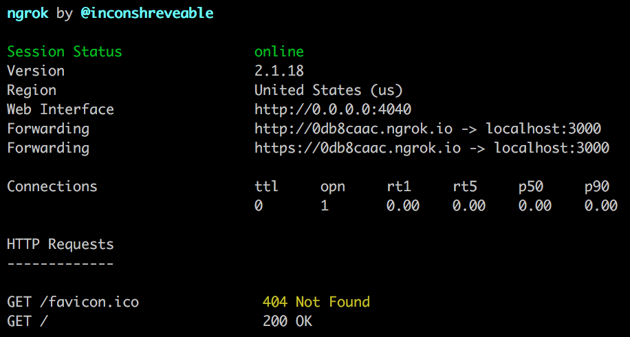
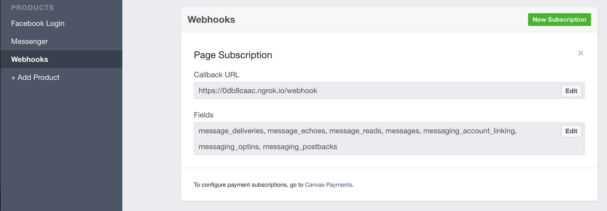
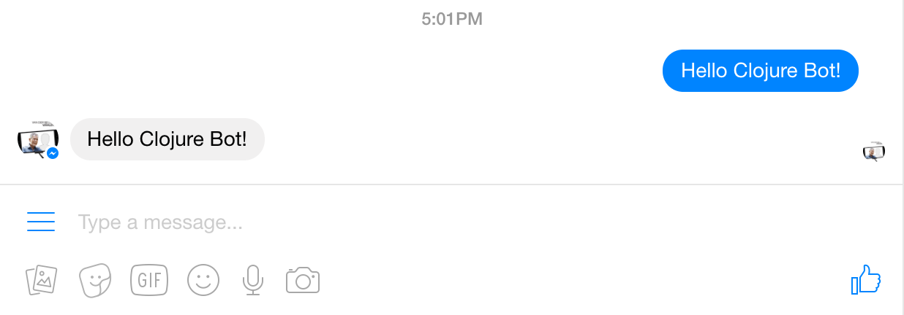

# Facebook Example

A Facebook Messenger Bot Example in Clojure

### Setup

1. Setup a Facebook Page, Facebook app, create a Page Access Token and link the app to the page by following this [step-by-step guide](https://github.com/prometheus-ai/fb-messenger-clj/wiki/Facebook-Setup).

2. Download the repository: [lemmings-io/02-facebook-example](https://github.com/lemmings-io/02-facebook-example/archive/master.zip)

3. Extract it into the `/lemmings/clojure/projects` directory.

4. Start a new VM shell session via `vagrant ssh`

5. In the VM shell change into the facebook-example project directory

		cd 02-facebook-example/

6. Run `ngrok http 3000` ([read more about ngrok](https://ngrok.com))

	

7. Start another new VM shell session via `vagrant ssh`

8. Add your Facebook Page Access Token to your environment

		export FB_PAGE_ACCESS_TOKEN="<YOUR_FB_PAGE_ACCESS_TOKEN>"

9. Start the local server

		lein ring server-headless

	
	
	Via the [lein-ring doc](https://github.com/weavejester/lein-ring): by default, this command attempts to find a free port, starting at 3000.

10. Visit the https URL as shown in step 4.  
	E.g. `https://0db8caac.ngrok.io`
	
	If everything went right, you'll see "Hello Lemming :)" in your Browser 🎈
	
	

11. In your Facebook Developer App go to "Webhooks" in the left sidebar and add `Callback URL` and `Verify Token` accordingly:

	

12. Click "Verify and Save" and your app is connected to Facebook's Messenger API 🎈

	
	
13. Go to your Facebook Page and send a message and your bot echo's your input. Congratulations!💧

	
	
Check out the code to find out more 🙂
		
Note: This clojure app is ready for deployment on Heroku and based on [Heroku's Clojure Getting Started Example](https://github.com/heroku/clojure-getting-started).